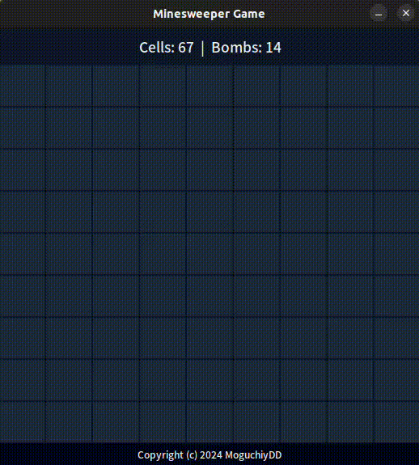

# Minesweeper Game
**Python** + **Tkinter**. Creation of the Minesweeper Game. Bombs from 10 to 19 (random)

The project was created and tested on the **Linux Ubuntu 22.04 Wayland** OS

## Information

  
  

